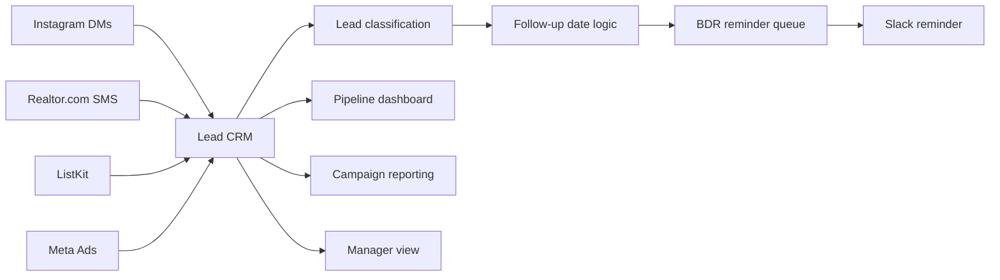

# Architecture

## Core components

### Lead CRM
Central record layer for lead source, status, quality, owner, first contact and next follow-up.

### Automation layer
Zapier and Make.com handled lead ingestion, tagging, reminders and supporting handoffs.

### Reporting layer
Airtable interfaces provided KPI blocks, charts, pipeline views and separate operational views for BDRs and managers.

### Handoff model

`Lead source → CRM record → classification → follow-up date → BDR reminder → meeting / close`

## Public demo behaviour

The GitHub Pages demo mirrors the operating model in a client-safe, self-contained browser environment. Lead edits persist in browser storage for the current device, and records can be exported as CSV or JSON.
